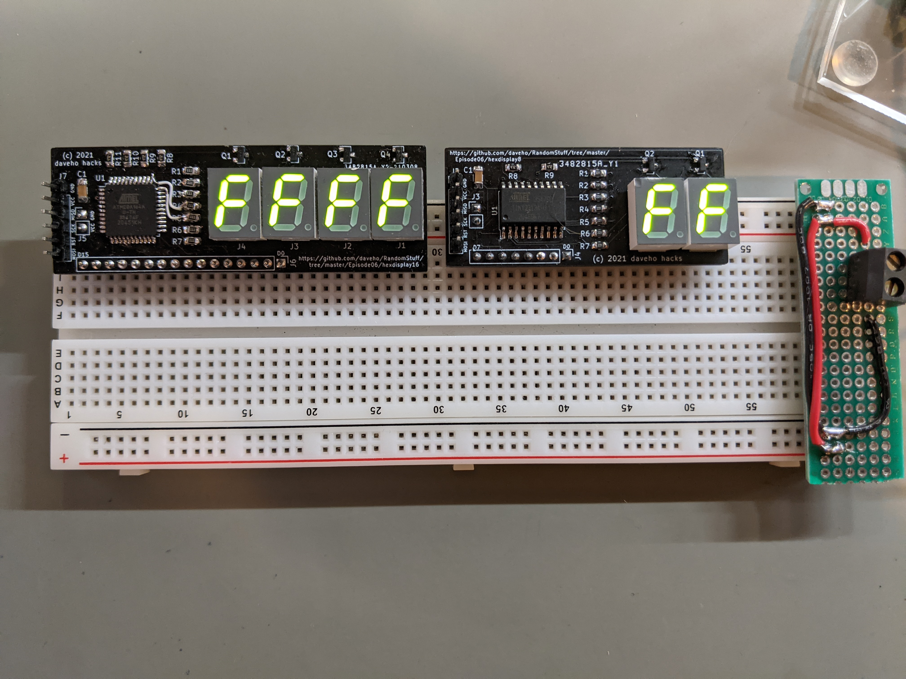

# Random Stuff Episode 7: Slightly better hex displays

Link to video: <https://youtu.be/nyYqotV60bU>

This is just a quick video with some additional progress on the hex displays
featured in the [Episode 6](../Episode06):

The progress is:

* The brightness of the 4-digit display is improved using lower value
  current-limiting resistors
* [Blue 7-segment displays](https://lcsc.com/product-detail/Led-Segment-Display_SUNLIGHT-SLR0361DBA3BD-4-0_C225953.html)
  (click for details) from [lcsc.com](https://lcsc.com/en) are tested

Unfortunately, the blue displays are narrower than the displays the PCBs were
designed for, so we'll need to update the PCB layout to accommodate them.
The good news is that this will further reduce the size of the PCBs.
We'll tackle that in a future episode.

The [Test7SegmentDisplay](Test7SegmentDisplay) directory has the Arduino sketch used
to experiment with current-limiting resistors.

The [hexdisplay8\_fw](hexdisplay8_fw) and [hexdisplay16\_fw](hexdisplay16_fw)
directories have very slightly modified versions of the firmware programs.
The only change is to increase the refresh rate from (approximately) 125 Hz to
500 Hz.  This change should avoid on-camera flickering, even with the brighter
blue displays.
