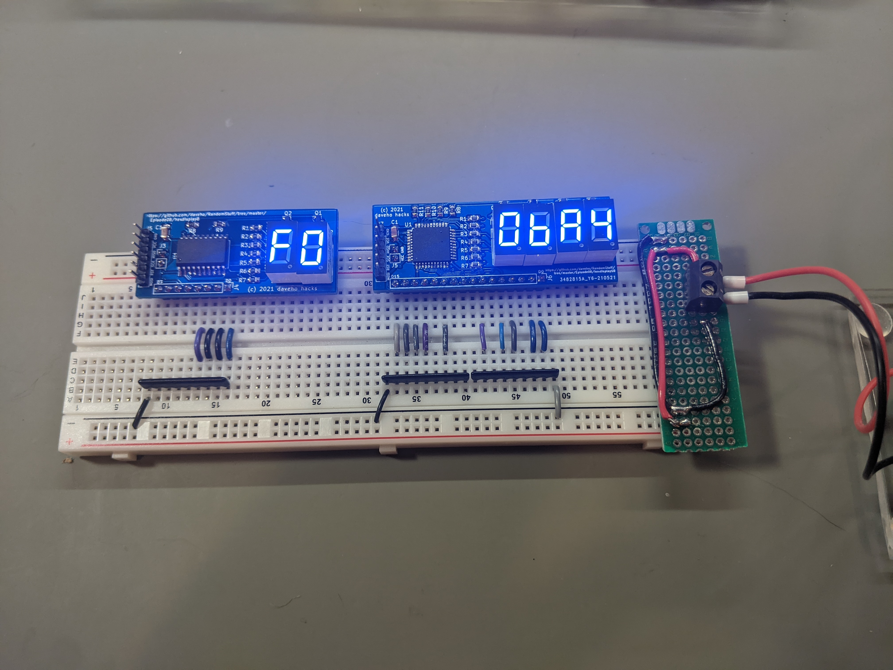

# Random Stuff Episode 8: Ultimate breadboard hex displays

Link to video: Coming soon

In this video we will create the "ultimate" versions of the 8 and 16
bit breadboard hex displays using the blue 7-segment displays from
[lcsc.com](https://lcsc.com/en).

The [hexdisplay8](hexdisplay8) directory has the schematics and parts
list for the 8 bit version.

The [hexdisplay16](hexdisplay16) directory has the schematics and parts
list for the 16 bit version.
