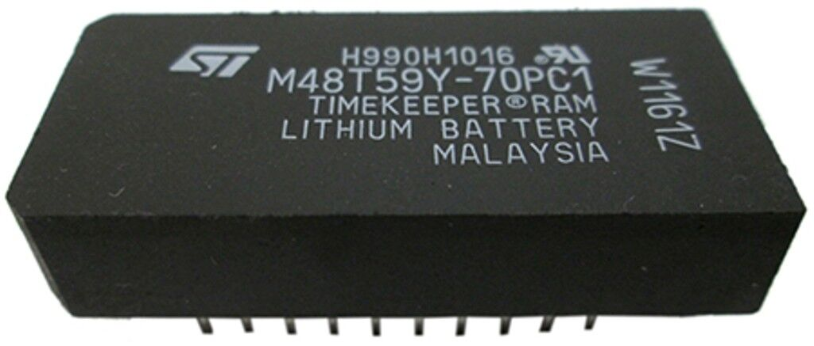
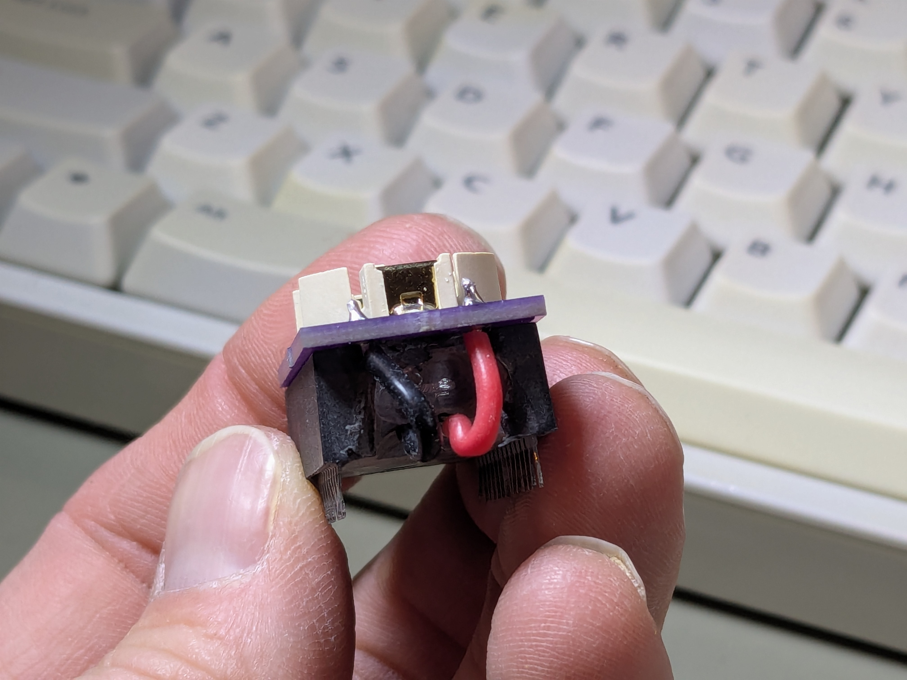
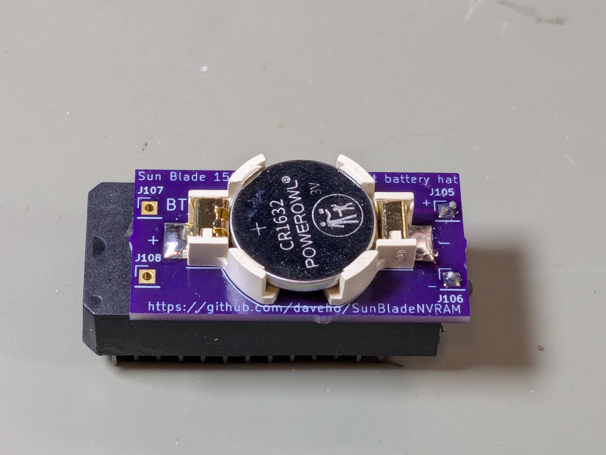
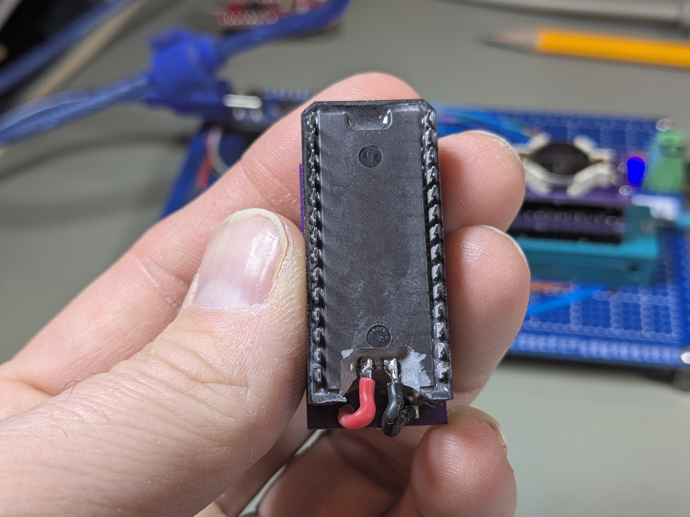
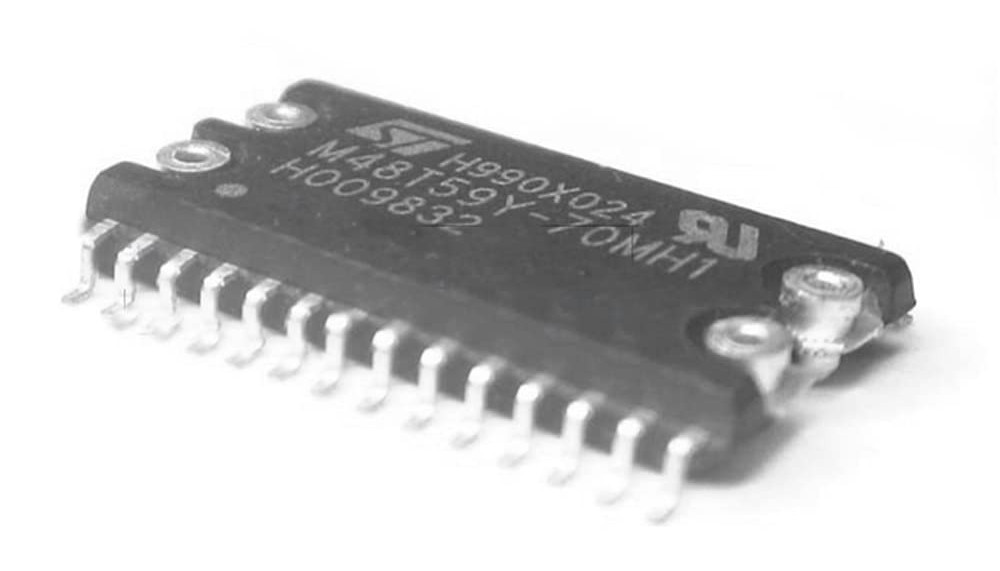
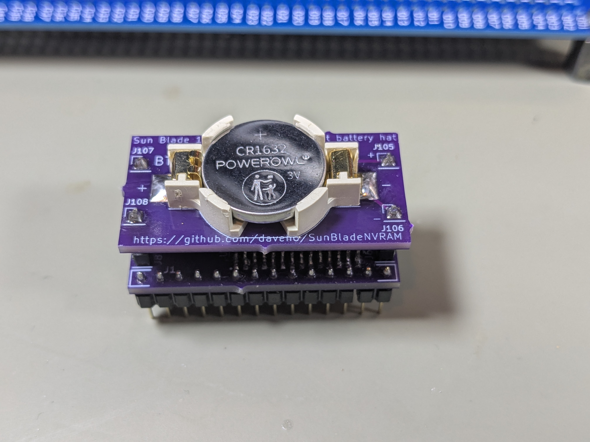
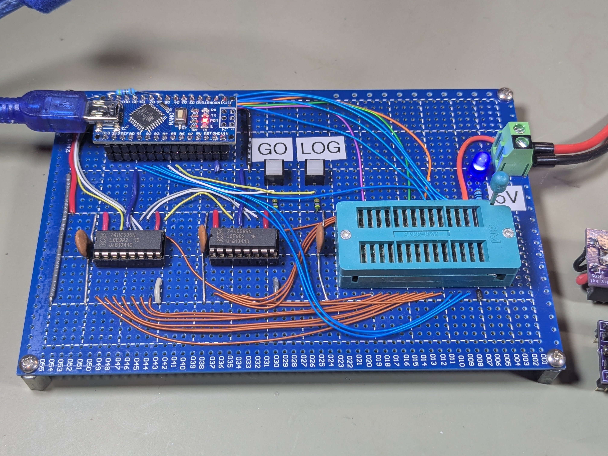

# Random Stuff, Episode 0xA

*Note: this is work in progress and will be updated.*

*Video link coming soon!*

In this episode, we investigate the
[M48T59Y](https://media.digikey.com/pdf/Data%20Sheets/ST%20Microelectronics%20PDFS/M48T59,Y_V.pdf)
nonvolatile RAM/RTC chip. This device was used in several Sun UltraSPARC workstations,
including a [Sun Blade](https://en.wikipedia.org/wiki/Sun_Blade_(workstation)) 150 which
I want to restore. Sun workstations use an NVRAM chip to store configuration information
such as the MAC address and boot options.  When the battery inside the device runs out,
this configuration information is lost.  Since these devices aren't manufactured any longer,
and haven't been for many years, some kind of replacement is needed.

## Replacement options

The Sun workstations (like my Sun Blade 150) used DIP-package
NVRAM/RTC chips. For the M48T59Y, this is the "-PC" variant.
These are basically just a standard 28-pin DIP device with a
plastic case on top containing the internal battery,
filled with potting compound (picture from EBay):



One replacement option involves grinding away the outer casing and potting compound
in order to expose the connections to the internal battery, soldering
wires to them, and connecting the wires to a coin cell battery holder
(click photos to embiggen):







There are two disadvantages to this approach:

1. It's annoying, time-consuming, and error-prone
2. Unless you're able to disconnect the internal battery embedded in the potting
   compound, the new coin cell battery could be drained trying to charge
   the dead internal battery

What I wanted was a replacement that could be assembled "from scratch", that
would have functionality equivalent to the original device.

Intriguingly, there is a surface-mount version of the chip that has "snap" connectors
for the battery and timing crystal, the "-MH" variant (picture from Amazon Japan):



In theory, you're supposed to use a separate
["SnapHAT" module](https://www.digikey.com/en/products/detail/stmicroelectronics/M4T28-BR12SH1/679615)
containing a battery and crystal, which snaps on top of the chip.
However, this still leaves you with the issue that the battery will
drain eventually, meaning you'll need to buy another SnapHAT, and
eventually these won't be manufactured any more. I really wanted
a solution with a proper coin cell battery holder so that I could
just replace the battery when I needed to.

My thought was that I could design a "stack" of small PCBs with the M48T59Y-70MH1,
a 32.768 kHz watch crystal, and header pins on the lower PCB, a coin cell
battery holder on the upper PCB, and stacking headers to join the two PCBs.
I was actually able to make this work:



Note that there are **significant compromises in the design of the lower PCB**,
and **it is fairly difficult to solder the components on the lower PCB**. I did eventually
arrive at an approach that works to some degree. The following document describes
the assembly steps (and also has the part list):

[Assembling the replacement module](assembly.md)

Also note that the M48T59Y-70MH1 is no longer available new, so you'll need to source
it from the usual secondary channels. I found some for a reasonable price from
a seller on AliExpress.

## Testing and programming

Just having an M48T59Y (either an original with the battery mod or my self-designed
replacement module) still leaves a couple of remaining issues:

* How do you know your M48T59Y is actually working correctly and retaining data
  when power is removed?
* How do you program the initial configuration information (such as the MAC
  address and hostid) into the device?

To address these issues, I designed and built a testing and programming circuit
using an Arduino Nano:



The [SunBladeNVRAMTest](SunBladeNVRAMTest) directory has the KiCad
project for the circuit. There is a [PDF of the schematic](SunBladeNVRAMTest/SunBladeNVRAMTest.pdf)
as well.

There are two Arduino sketches (just load the one you want to use into the
Arduino Nano.)

Before you can use the Arduino sketches, you need to "install" the
[m48t59y](m48t59y) library, which contains common definitions and functions
used by all of the sketches. To do so, either symlink or copy the
contents of the `m48t59y` directory into your `Arduino/libraries`
directory. On my Linux system, I did this by running the commands

```
cd ~/Arduino
mkdir -p libraries
cd libraries
ln -s ~/git/RandomStuff/Episode0a/m48t59y
```

You should replace `~/git/RandomStuff` with the path to where you checked
out the [RandomStuff](https://github.com/daveho/RandomStuff/) repo.

If you're using Windows, then I believe your `Arduino` directory
will be in your `My Documents` folder. If you create a `libraries` folder
(if it doesn't already exist) and then copy the `m48t59y` directory there,
that should work.

These are the sketches:

* [Test\_M48T59Y/Test\_M48T59Y.ino](Test_M48T59Y/Test_M48T59Y.ino):
  the test sketch (press GO to start the test; if you hold down LOG when
  you press GO any data validation errors will be logged)
* [Program\_M48T59Y/Program\_M48T59Y.ino](Program_M48T59Y/Program_M48T59Y.ino):
  the programming sketch (edit the code to fill in the machine type information
  and MAC address, upload it to the Nano, then press GO to program the
  correct IDPROM information into the M48T59Y)
