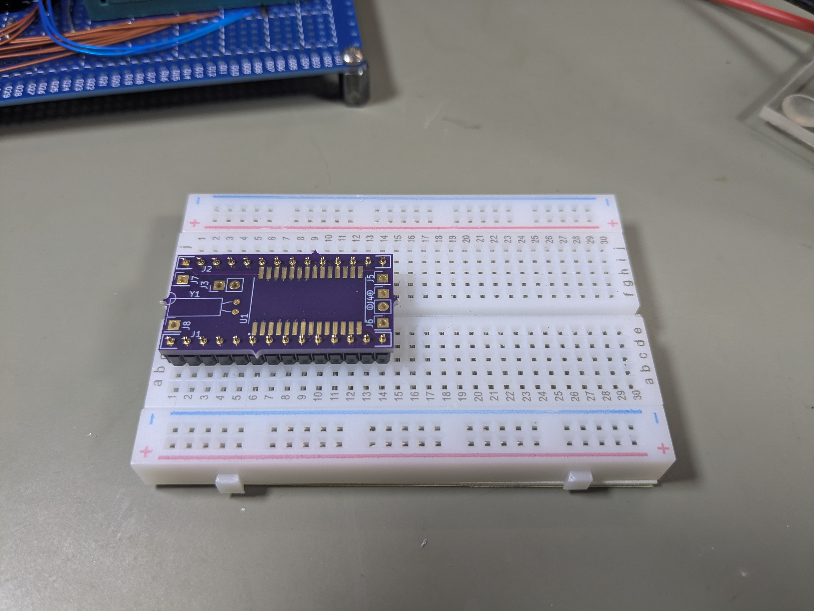
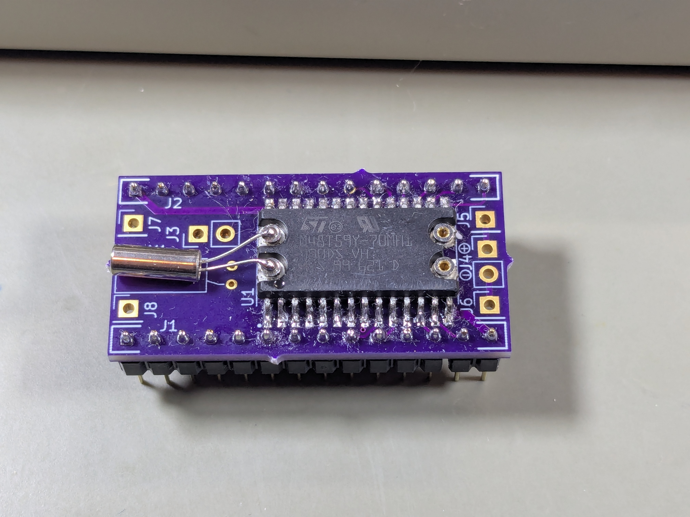

# Assembling the M48T59Y replacement module

**Disclaimer**: Please understand that I make absolutely no guarantees about
the correctness or suitability of the module design or assembly instructions.
Use them at your own risk.

## Parts list

Part | Description | Link/Note
---- | ----------- | ---------
M48T59Y-70MH1 | NVRAM/RTC chip | <https://www.aliexpress.us/item/3256802740089990.html>
32.768 kHz crystal | timing for RTC | any watch crystal with 12.5 pF loading should work
BU1632SM-JJ-GTR | coin cell holder | <https://www.digikey.com/en/products/detail/mpd-memory-protection-devices/BU1632SM-JJ-GTR/2079901>
DW-06-08-T-S-300 | stacking header | <https://www.digikey.com/en/products/detail/samtec-inc/DW-06-08-T-S-300/6728113>
MH254V-11-40-1196 | pin headers | <https://www.lcsc.com/product-detail/Pin-Headers_XFCN-MH254V-11-40-1196_C510960.html>

The choice of stacking header isn't critical, so use whatever makes sense.
Note that your header pins should be the thin/round machined kind.
The standard square ones won't fit, and would damage the IC socket
on the motherboard when you try to plug the module in.

Also note that the coin cell battery holder seems to be a fairly standard
design, so there are likely other parts you could use here.

Obviously you'll also need the two PCBs (from the [SunBladeNVRAM](SunBladeNVRAM)
KiCad project). I highly recommend [OSHPark](https://oshpark.com/) for fab services
(just upload the `.kicad_pcb` files and you're good to go.)

## Assembly tips

In order to allow the M48T59Y-70MH1 to fit on the lower PCB between the header pins,
I had to reduce the size of its footprint. This means that the chip is only *slightly*
narrower than the footprint, which makes soldering quite challenging. Also,
the through holes for the pin headers are tiny, and if you get any solder on
them before getting the headers in place you won't be able to get the headers
in. (Ask me how I know this...)

So, here is the assembly procedure that I have found works acceptably. It's still
going to be a pain in the butt, but (IMO) no more so than taking a dremel to a
M48T59Y-70PC1.

### Step 1: pins in breadboard, lower PCB on pins

Put the header pins in a breadboard and mount the lower PCB on them.
You need to do this now because if you get any solder on the through holes
for the header pins as you attempt to solder the M48T59Y-70MH1,
it's game over, you won't be able to get the header pins in.

If you felt like soldering the header pins at this point, you
could, but it's not really necessary since they will fit very
tightly.

### Step 2: solder the MH48T59Y-70MH1

This is the hard part! My approach is the following:

1. Tin the pads so that there is some solder on each pad
2. Apply flux to the pads and also to the legs of the chip
3. Very carefully solder two opposing corner legs so that the
   chip is held in place and all legs are aligned with their
   pads
4. Solder the remaining legs

**Make sure that pin 1 is in the correct position.** There is a dot
on the silkscreen just to the left of pin 1's pad.

To solder the legs, I have found that if I hold the iron vertically down
onto a pair of legs (touching their "feet"), heating them up and also
heating up the solder on their pads, I can feed more solder down onto
the legs which (hopefully!) flows onto the pads and connects the legs
to their pads. It's very possible to create a bridge between the two legs
at this point, but you should be able to clean it up with the iron.
If a solder blob gets attached to a pin, you'll probably need to use some
solder wick to remove it. Take your time.

Once all legs have been soldered, use a pair of fine tweezers or other
similar tool to gently prod each IC leg. The idea is to determine whether
there are any legs that aren't actually soldered to their pads. If the
leg moves, touch it up with additional solder using the same technique
you used to solder it initially, and prod it again. Repeat until all of the
legs are firmly attached.

If you haven't already done so, solder the header pins. You should now
have something that looks like this:

*TODO: picture*

### Step 3: test the partially-complete module

At this point, use the test sketch in the tester/programmer circuit
to test the partially-completed module. The initial memory verification
should fail, but the second memory verification should succeed.
(The clock test(s) will fail, but we don't care about those yet.)
If the memory verification succeeds, that's excellent news, since it
means that the device works as a volatile SRAM, implying that the
address, data, and control signals are connected properly.

If the memory verification fails, re-check the soldering of the legs.
Touching up a dodgy connection could fix the problem.

If you can't get memory verification to pass, then you probably have
a bad M48T59Y-70MH1.

### Step 4: solder the crystal

The next step is to solder the 32.768 kHz crystal onto the "snap" connectors
at the "pin 1" end of the chip. Note that my initial PCBs had through holes
on the board for the crystal, as well as through holes to connect wires to
the snap connectors on the chip. However, there's really no advantage to
doing these connections on the board, so I think wiring the crystal to the
chip is the best option. You should end up with something that looks like
this:

### Step 5: test the partially-complete module again

Test the module again using the test sketch. Now, both the second
memory verification and the clock tests should pass.

### Step 6: wire the battery connections and solder the stacking pins

Next, solder wires to connect the battery snap connectors (at the opposite end
of the chip from the crystal snap connectors) to the J4 pins on the bottom
PCB. The J4 through holes are labeled "-" and "+", and these should each be wired
to the closest snap connector. (The "-" connection is the snap connector closest
to pin 14 of the IC.)

Also, solder the stacking headers onto the lower PCB. My approach is to put
in the stacking headers, then fit the upper PCB on them, flip the whole thing
upside-down, then solder the stacking headers to the bottom of the lower PCB.
Doing this with the upper PCB fitted keeps the stacking header pins aligned
correctly. You should end up with something that looks like this:

*TODO: picture*

### Step 7: test again using bench PSU to provide "battery" power

The stacking headers closest to the battery connectors are uses to
connect the battery to the chip. Using clip leads, apply 3.2V DC to
the chip's battery connections. Then, re-test the module using the
Test sketch. You will need to run the test twice.

The first time you run the test, the initial memory verification will
fail, but the second memory verification will succeed. (The clock tests
should pass.) **Take the module out of the tester/programmer circuit.**

Let the module chill for a minute or two, leaving the bench PSU-supplied
"battery" power connected.

Now, re-test the module. **All tests should pass**, including the first
memory verification test. What we're doing here is testing whether
the data written by the first test is retained after external power
is removed.

If all tests pass, then you're almost done! You can remove the
clip leads from the stacking headers at this point.

### Step 8: solder the battery holder, attach the top PCB

The last steps are to solder the battery holder to the top PCB
(make sure that the positive and negative connections are soldered
to the "+" and "-" pads on the PCB as indicated), and then solder
the top PCB to the stacking headers you soldered on in Step 6.

Now you can pop in a CR1632 coin cell and you should have something
like this:

Re-run two more tests. The only step that should fail is the initial
memory verification test. Subsequently, each time you run the test,
**all** tests should pass. If you reach this point, congratulations,
you have (in theory) a working M48T59Y replacement.
